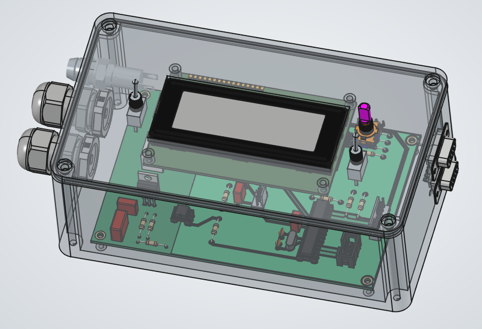
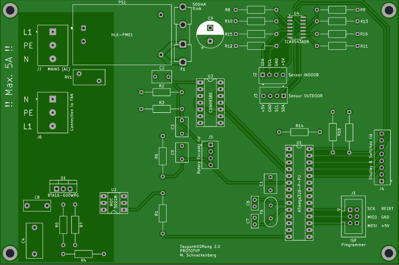

# Taupunktlüftung

## Überblick
Realisierung einer Taupunkt gesteuerten Lüftung, die die Lüftung nur dann einschaltet, wenn die Taupunkt-Temperatur der Umgebungsluft (Abluftraum - bspw. außerhalb des Gebäudes) deutlich niedriger ist, als die Taupunkt-Temperatur des Raumes, der be- bzw. entlüftet werden soll.

## Elektrotechnischer Hinweis
Ich mache an dieser Stelle darauf aufmerksam, dass diese Steuerung an einer 230V/50Hz Netzspannung betrieben wird. Es sind die einschlägigen Vorschriften für das Arbeiten, Anschließen und Betreiben einer elektrischen Anlage an 230V/50Hz zu beachten! Personen, die weder Erfahrung noch die nötige Ausbildung in der Elektrotechnik besitzen rate ich daher ausdrücklich vom Nachbau ab.
Dies ist ein Hobby-Projekt mit keinerlei Zualssung für den regelmäßigen Betrieb / Anschluss am 230V/50Hz Netz.

## Umsetzung
### Elektronik & Leiterplatte (PCB)
Für die Steuerung kommt ein Microcontroller vom Typ Atmel 328P zum Einsatz. Der Lüfter wird über einen Optokoppler MOC3021M / TRIAC BTA 16-600 angesteuert, die mit Peripherie-Beschaltung ein Solid-State-Relais bilden.
Die Messung der Temperaturen und relativen Luftfeuchten des Abluftraumes / zu belüftenden Raumes wird über Sensoren vom Typ GY-21 HTU21 realisiert, die über einen I²C-Multiplexer TCA9543ADR an den Microcontroller angebunden werden.

Eine Daten-Ausgabe findet auf einem LCD-Display (DOT-Matrix) mit 4 Zeilen zu je 20 Zeichen (4x20) statt, welches über I²C an den Microcontroller angebunden wird. Die Hintergrundbeleuchtung des Displays kann über einen Kipptaster aktiviert werden. Der gleiche Kipptaster löst in der anderen Richtung einen Reset des Mikrocontrollers aus.

Ein Dreh-Encoder mit Tast-Funktion wird für die Menu-Steuerung eingesetzt. Das Menu und die Einstellungen werden über das LCD-Display angezeigt.

Über einen Kipp-Schalter kann die Steuerung in den
1. dauerhaft EIN-Modus (Lüfter läuft ständig)
2. deaktivierten Modus (Lüfter ist dauerhaft deaktiviert)
3. in den Automatik-Modus (Taupunkt gesteuerte Be- bzw. Entlüftung)
versetzt werden.

Die Leiterplatte ist für eine Stromaufnahme von 5A bei 230VAC ausgelegt und wird über eine entsprechende Sicherung 5x20mm, 5A mittelträge vor Überstrom geschützt. Der Kleinspannungsbereich auf der PCB ist zusätzlich über eine Sicherung 5x20mm, 500mA flink abgesichert.

Der Aufbau findet bewusst im aktuellen Stadium der Entwicklung mit THT-Bauteilen (mit Ausnhame des I²C-Multiplexers, den es nur als SMD SO-14 Package gibt) statt.

## Gehäuse
Das Gehäuse wurde über eine CAD-Software konstruiert und mittels 3D-Druck erstellt. Alle Komponenten wurden im 3D-Modell eingefügt.
Die Leiterplatte sitzt auf Distanzbolzen des Gehäuses, das Display ist an der Rückseite des Deckels befestigt. Die Konnektivität der Sensoren ist über D-SUB Buchsen / Stecker realisiert.

## Verwendete Software
|Programm   |Verwendung                               |Dateiformat |
|-----------|-----------------------------------------|------------|
| [FreeCAD](https://www.freecad.org)    | CAD Konstruktionen | .FCStd |
| [KiCAD](https://www.kicad.org/)| Schaltpläne | .kicad_sch |
| [KiCAD](https://www.kicad.org/)| PCB Layout | .kicad_pcb |

## PCB Hersteller
Ich bin sehr zufrieden mit dem deutschen PCB-Hersteller AISLER Germany GmbH mit Sitz in Aachen.
